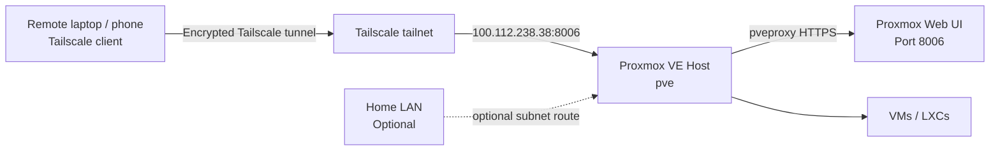

# Proxmox Web UI over Tailscale

Access your Proxmox VE web UI securely from anywhere using Tailscale without exposing port `8006` to the public internet.

This kit is configured for:

- Proxmox host: `pve`
- Tailscale IP: `100.112.238.38`
- MagicDNS name: `pve.tailc2b3f5.ts.net`
- Proxmox web UI: `https://100.112.238.38:8006`

## Network topology



## How it works

Tailscale gives the Proxmox host a private `100.x.x.x` address. Any device signed into the same tailnet can connect to that address from anywhere. No router port forwarding is required.

The Proxmox UI remains available on:

```text
https://100.112.238.38:8006
```

Or, if MagicDNS is enabled:

```text
https://pve.tailc2b3f5.ts.net:8006
```

## Files

```text
config/tailscale-proxmox.env          # editable config
scripts/install-tailscale-proxmox.sh  # run on Proxmox host as root
scripts/check-client-macos.sh         # run on macOS client to test access
README.md                             # this guide
```

## 1. Edit config

Open:

```bash
config/tailscale-proxmox.env
```

Important values:

```bash
PVE_HOSTNAME="pve"
PVE_TAILSCALE_IP="100.112.238.38"
PVE_WEB_PORT="8006"
PVE_MAGICDNS_NAME="pve.tailc2b3f5.ts.net"
TS_ENABLE_SSH="true"
TS_ADVERTISE_ROUTES=""
```

Leave `TS_ADVERTISE_ROUTES` empty unless you want this Proxmox host to act as a subnet router for your LAN.

## 2. Install Tailscale on Proxmox

SSH into Proxmox as root, clone this repo, then run:

```bash
sudo ./scripts/install-tailscale-proxmox.sh ./config/tailscale-proxmox.env
```

The script will:

- install Tailscale if missing
- enable and start `tailscaled`
- bring the node online
- set the Tailscale hostname to `pve`
- optionally enable Tailscale SSH
- verify that Proxmox is listening on port `8006`

## 3. Install Tailscale on your macOS client

Install the official macOS app:

```text
https://tailscale.com/download
```

Then:

1. Open the Tailscale app.
2. Sign in with the same account used on Proxmox.
3. Confirm the app says `Connected`.
4. Open the Proxmox UI:

```text
https://100.112.238.38:8006
```

## 4. Optional: verify from macOS terminal

Run:

```bash
./scripts/check-client-macos.sh ./config/tailscale-proxmox.env
```

Expected results:

- `nc` to `100.112.238.38 8006` succeeds
- `curl -k -I https://100.112.238.38:8006` returns an HTTP response
- MagicDNS works if Tailscale DNS is enabled

## 5. MagicDNS setup

In the Tailscale admin console:

1. Go to DNS.
2. Enable MagicDNS.
3. Enable Tailscale DNS settings.
4. Reconnect the macOS Tailscale app.

Then test:

```text
https://pve.tailc2b3f5.ts.net:8006
```

## 6. Troubleshooting

### Proxmox works locally but not over Tailscale

On Proxmox:

```bash
ss -tlnp | grep 8006
curl -k https://127.0.0.1:8006
pve-firewall status
tailscale status
```

If local curl returns the Proxmox HTML page, the web service is working.

### Browser loads forever

From the client machine:

```bash
curl -vk https://100.112.238.38:8006
nc -vz 100.112.238.38 8006
```

If both time out, the client is not reaching TCP port `8006` over Tailscale.

Common fixes:

- make sure the Tailscale app is connected
- disable other VPNs temporarily
- try a phone on cellular data with Tailscale enabled
- check Proxmox firewall rules
- verify both devices are in the same tailnet

### Tailscale CLI not found on macOS

This is normal if only the GUI app is installed. Use the app, or install the CLI separately with Homebrew:

```bash
brew install tailscale
```

### MagicDNS does not resolve

If this fails:

```bash
curl -k https://pve.tailc2b3f5.ts.net:8006
```

but the IP works, enable MagicDNS and reconnect the Tailscale app.

## Security notes

Do not forward Proxmox port `8006` on your router. Keep the UI private behind Tailscale.

Recommended:

- enable Proxmox 2FA
- use strong passwords or SSH keys
- keep Proxmox updated
- restrict Tailscale access using ACLs if sharing the tailnet
- avoid exposing the Proxmox UI to the public internet
