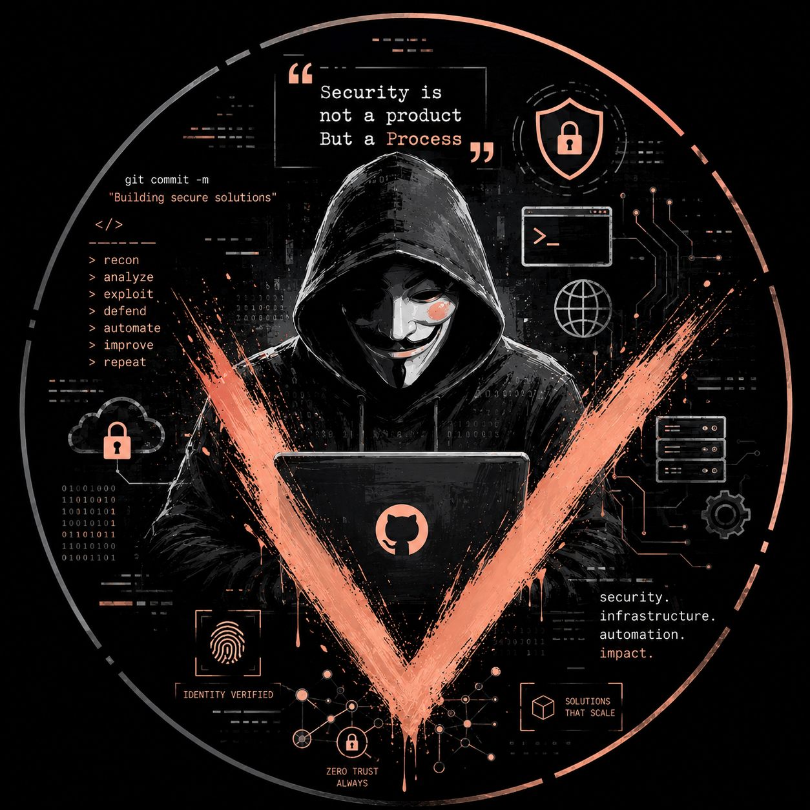

<!--
  HOW TO USE THIS FILE:
  GitHub shows a special README on your profile page if you create a repo
  named EXACTLY your username (e.g. github.com/AntonLesl/AntonLesl) and put
  a README.md in it. Create that repo (public, no need for anything else in
  it), copy the assets/hero-banner.png file into it too (same relative path:
  assets/hero-banner.png), and paste this file in as its README.md. That's it —
  it becomes your profile page.
-->

  

# Hey, I'm Anton 👋

### IT Systems Administrator · Builder &amp; Documenter of Real Infrastructure

---

### 🧭 What I'm about

I'm a systems administrator with 4+ years managing enterprise identity and endpoints (Entra ID, Intune, on-prem AD) who builds — publicly, from scratch — real infrastructure and documents every step of it. My [homelab](https://github.com/AntonLesl/homelab-portfolio) is a real enterprise-style network with a firewall, VLANs, a SIEM, an isolated attack lab, and 35+ documented real troubleshooting issues. I'm steadily working through a certification roadmap alongside it — not aimed at one narrow title, just building broad, provable capability.

### 🗺️ Where I am right now

**→ Full roadmap with timeline and reasoning: [ROADMAP.md](https://github.com/AntonLesl/homelab-portfolio/blob/main/ROADMAP.md)**

### 🛠️ Tools I work with

pfSense · Proxmox VE · Wazuh SIEM · Suricata IDS · Greenbone/OpenVAS · Active Directory · Entra ID · Intune · Tailscale · Kali Linux · nmap · Wireshark

### 📌 Featured build

A full enterprise network + SIEM + isolated attack lab, built on physical hardware and documented step by step — what was built, every command, and every real problem hit along the way with root cause and fix. This is the practical companion to the roadmap above: each cert maps to something already running in this lab.

### 📊 GitHub activity

### 📫 Reach me

&nbsp;·&nbsp;
📍 Calumet City, IL — open to IT, systems administration, networking, and security roles

This page and the roadmap it links to are updated as certs are completed — check back for progress.

