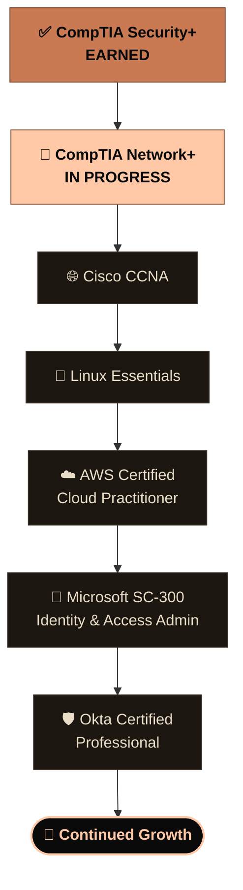
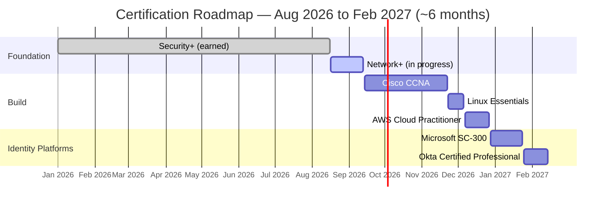

  

<h1 align="center">🗺️ Certification Roadmap</h1>

<b>Anton Leslie</b> · Last updated: August 17, 2026

> This is the map of where I've been and where I'm headed — from Security+ toward broad, real-world capability across networking, systems, and security. Every stop on this map is backed by hands-on work in the [homelab](./README.md) above, not just an exam voucher.

---

## 🎯 Where This Is Headed

Broad, real-world capability across networking, systems administration, and security — not a bet on one narrow title. Each cert earns a real, transferable skill, and the order is built to compound: networking depth first (Network+ into CCNA, while it's freshest), then a quick Linux win, then cloud fundamentals, with Microsoft SC-300 and Okta rounding things out with dedicated identity-platform experience. Useful everywhere it could lead — SOC analyst, security engineer, systems/network admin, or identity-focused roles.

---

## 🧗 The Skill Path

**Legend:** 🟤 Earned &nbsp;·&nbsp; 🍑 In progress &nbsp;·&nbsp; ⚫ Planned &nbsp;·&nbsp; ⬛ Ongoing

---

## 📅 Timeline

*Dates are a planning estimate, not a deadline — the point is momentum, not a race. Adjust as real life happens.*

---

## 🧩 The Order, and Why

| # | Cert | Status | Window | Why it's here and not somewhere else |
|---|------|--------|--------|----------------------------------------|
| 1 | **CompTIA Security+** | ✅ Earned | — | The baseline — CIA triad, risk, threats, controls. Everything else builds on it. |
| 2 | **CompTIA Network+** | 🔄 In progress | Aug 17 – Sep 13 | You can't secure a network you don't understand. Direct payoff already: VLANs, NAT, and firewall rules in the homelab match this material 1:1. |
| 3 | **Cisco CCNA** | ⬜ Next | Sep 14 – Nov 22 | Right after Network+ while routing, switching, and subnetting are freshest — deepens networking immediately instead of letting momentum go cold on unrelated material first. |
| 4 | **Linux Essentials** | ⬜ Planned | Nov 23 – Dec 6 | A fast, lower-stakes win after the CCNA marathon — formalizes skills already in daily use: Wazuh, pfSense, Pi-hole, and Kali all run on Linux. |
| 5 | **AWS Certified Cloud Practitioner** | ⬜ Planned | Dec 7 – Dec 27 | The shortest, most foundational cloud cert — seeds the vocabulary (IAM, roles, policies) that SC-300 later goes deep on, without requiring hands-on AWS infra first. |
| 6 | **Microsoft SC-300** (Identity & Access Administrator) | ⬜ Planned | Dec 28 – Jan 24 | Builds directly on the homelab's Windows Server 2022 AD domain controller and on-the-job Entra ID / Intune experience — formalizes skills already in use. |
| 7 | **Okta Certified Professional** | ⬜ Planned | Jan 25 – Feb 14 | The capstone: a dedicated, market-leading identity platform. Comes last because SC-300 builds the identity *concepts* (federation, SSO, conditional access, provisioning) that Okta's platform-specific exam then applies. |

---

## 🔗 How the Homelab Already Backs This Up

| Cert target | Already demonstrated in this repo |
|---|---|
| Network+ / CCNA | [`02-pfsense-firewall`](./02-pfsense-firewall/), [`03-managed-switch`](./03-managed-switch/) — real 802.1Q VLAN trunking, firewall rule design, NAT |
| Linux Essentials | [`07-wazuh-siem`](./07-wazuh-siem/), [`05-pihole-dns`](./05-pihole-dns/), [`09-cyber-lab`](./09-cyber-lab/) — Linux services deployed, configured, and troubleshot from scratch |
| AWS CCP / cloud identity | Entra ID + Intune administration (500+ users, per [`RESUME.md`](./RESUME.md)) — direct analog to cloud IAM concepts |
| SC-300 | [`09-cyber-lab/active-directory-setup`](./09-cyber-lab/active-directory-setup/) — Windows Server 2022 AD DC, OUs, service accounts, SPNs, domain joins |
| Okta Certified Professional | Same AD/identity foundation, extended to a dedicated platform — the natural next lab addition once SC-300 is underway |

---

## ✅ How to Read This Roadmap

- 🟢 **Earned** — exam passed, cert active
- 🟠 **In progress** — actively studying right now
- ⬜ **Planned** — next in the queue, order is deliberate (see table above)
- Each phase gets a **daily study nudge** — see [`DAILY-STUDY-PLAN.md`](./DAILY-STUDY-PLAN.md) for the weekly rhythm behind it.

---

*This roadmap is a living document — status badges and the timeline get updated as certs are completed. Full build details and troubleshooting logs live in the main [README](./README.md) and [BUILD-JOURNAL.md](./build-journal/BUILD-JOURNAL.md).*
