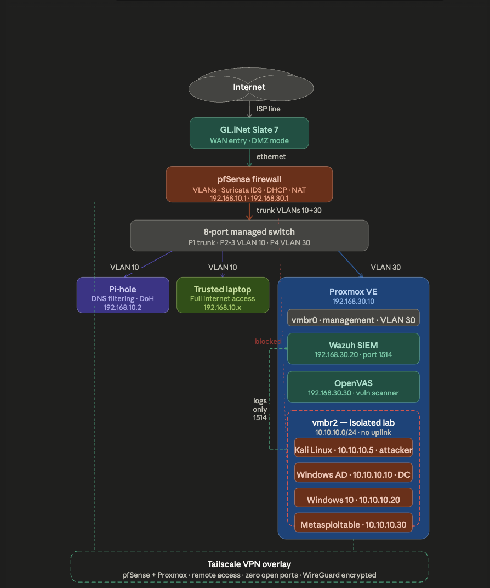

# Diagrams

Network topology and architecture diagrams for the homelab portfolio.

> **As-built diagrams** — updated to reflect what was actually implemented, including design decisions made during the build.

---

## Network Topology (As Built)



> Complete homelab from ISP → Slate 7 → pfSense (ThinkCentre) → Netgear GS308E switch → VLAN 1 trusted devices and VLAN 30 Proxmox server. Inside Proxmox: vmbr0 hosts Pi-hole, Wazuh, Homarr, OpenVAS. vmbr2 (no uplink) hosts the isolated cyber lab. Tailscale mesh connects all devices remotely.

---

## Proxmox Bridge Design


> vmbr0 (no VLAN tag — switch port 4 is untagged VLAN 30) hosts management services. vmbr2 (bridge-ports none) is a fully isolated internal bridge for cyber lab VMs. One-way Wazuh log route via static host route.

---

## Switch VLAN Port Map


> Netgear GS308E in Advanced 802.1Q mode. Port 1 tagged trunk to pfSense. Port 3 untagged VLAN 1 (trusted). Port 4 untagged VLAN 30 (Proxmox). Advanced mode was required — Basic mode breaks client ethernet connectivity.

---

## Cyber Lab Isolation


> vmbr2 has no physical uplink. Containers get no VLAN tags (switch port 4 is untagged VLAN 30 — no tags needed). Only outbound path: Proxmox host static route to Wazuh on port 1514.

---

## Key Design Changes From Original Plan

| Original Plan | What Was Actually Built | Why |
|---------------|------------------------|-----|
| Pi-hole on 192.168.10.2 (VLAN 10) | Pi-hole on 192.168.30.2 (VLAN 30) | Proxmox is on VLAN 30 — all containers inherit this subnet |
| VLAN 10 as separate subinterface | LAN used directly as trusted network | Creating VLAN 10 caused IP overlap with existing LAN config |
| Containers with VLAN tag 30 | Containers with no VLAN tag | Switch port 4 is untagged VLAN 30 — double tagging broke connectivity |
| cloudflared for DoH | Unbound recursive resolver | cloudflared proxy-dns removed in version 2026.2.0 |
| Basic 802.1Q trunk | Advanced 802.1Q VLAN | Basic mode sends tagged frames to access ports breaking client ethernet |

---

## File Index

| File | Description | Status |
|------|-------------|--------|
| `full-topology.png` | Complete as-built network topology | Add screenshot |
| `proxmox-bridges.png` | vmbr0 and vmbr2 bridge design | Add screenshot |
| `switch-vlan-map.png` | GS308E port assignment | Add screenshot |
| `cyber-lab-isolation.png` | Cyber lab isolation design | Add screenshot |

---

## How to Add Screenshots (Mac)

```bash
# Screenshot a region
Cmd + Shift + 4 → drag to select → auto-saves to Desktop

# Move to diagrams folder via Tailscale SSH or direct
mv ~/Desktop/Screenshot*.png ~/homelab-portfolio/diagrams/FILENAME.png

git add diagrams/
git commit -m "Add network diagram"
git push
```
